Objectives
==========

-   From a list, select the most appropriate pattern for a given scenario. Patterns are limited to those documented in Core J2EE Patterns: Best Practices and Design Strategies, 2nd Edition
-   From a list, select the most appropriate pattern for a given scenario. Patterns are limited to those documented in Design Patterns: Elements of Reusable Object-Oriented Software;
-   Select from a list the benefits and drawbacks of a pattern drawn from the book - Design Patterns: Elements of Reusable Object-Oriented Software
-   Select from a list the benefits and drawbacks of a specified Core J2EE pattern drawn from the book - Core J2EE Patterns: Best Practices and Design Strategies, 2nd Edition

GoF patterns
============

-   are categorized into three categories
    -   Creational - Support the creation of objects
    -   Structural - Deal with relationships between portions of your application
    -   Behavioral - Influence how state and behavior flow through the system
-   Examples in JDK [http://stackoverflow.com/questions/1673841/examples-of-gof-design-patterns/2707195\#2707195 here](http://stackoverflow.com/questions/1673841/examples-of-gof-design-patterns/2707195#2707195_here "wikilink")

Creational Patterns
-------------------

-   allow objects to be created in a system without having to identify a specific class type in the code
-   It does this by having the subclass of the class create the objects
-   can limit the type or number of objects that can be created within a system

### Abstract Factory Pattern

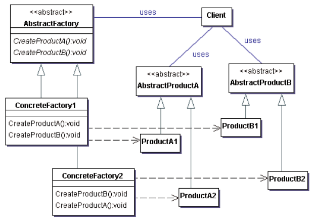

-   provides an interface for creating families of related or dependent objects without specifying their concrete classes
-   provides an abstract class that determines the appropriate concrete class to instantiate to create a set of concrete products that implement a standard interface
-   The client never knows about the concrete construction classes provided by this pattern
-   similar to the Factory Method pattern, except it creates families of related objects
-   **Benefits**
    -   Isolates the concrete classes from client
    -   Allows for exchanging product families easy
    -   Promotes consistency among products by implementing the common interface
-   **When to Use**
    -   The system should be independent of how its products are created, composed, and represented
    -   The system should be configured with one of multiple families of products
    -   The family of related product objects is designed to be used together, and you must enforce this constraint
        -   **This is the key point of the pattern**
    -   You want to provide a class library of products, and reveal only their interfaces, not their implementations

### Builder Pattern

-   separates the construction of a complex object from its representation so the same construction process can create different objects.
-   allows a client object to construct a complex object by specifying only its type and content
-   The client is shielded from the details of the object's construction
-   produces one main product, and there might be more than one class in the product, but there is always one main class
-   **When you use the Builder pattern, you create the complex objects one step at a time. Other patterns build the object in a single step**
-   **Benefits**
    -   Isolates code for construction and representation
    -   Gives you greater control over the construction process
    -   Lets you vary a product's internal representation
-   **When to Use**
    -   The algorithm for creating a complex object should be independent of both the parts that make up the object and how these parts are assembled.
    -   The construction process must allow different representations of the constructed object

### Factory Method Pattern

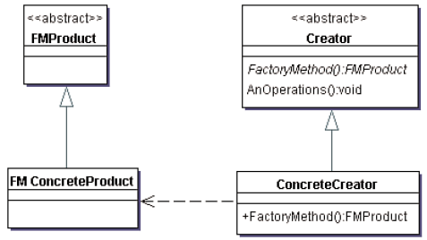

-   defines an interface for creating an object, but lets the subclasses decide which class to instantiate
-   is useful for constructing individual objects for a specific purpose without the requestor knowing the specific class being instantiated
-   This enables you to introduce new classes without modifying the code because the new class implements only the interface so it can be used by the client
-   **Benefits**
    -   The code deals only with the interface
    -   creating an object inside a class is more flexible than creating the object directly in the client
-   **When to Use**
    -   A class cannot anticipate the class of objects it must create
    -   A class wants its subclasses to specify the objects it creates
    -   Classes delegate responsibility to one of several helper subclasses, and you want to localize the knowledge of which helper subclass is the delegate

### Prototype Pattern

-   allows an object to create customized objects without knowing their exact class or the details of how to create them
-   It specifies the kinds of objects to create using a prototypical instance and creates new objects by copying this prototype.
-   creates objects by asking the prototypical objects to make copies of themselves
-   makes creating objects dynamically easier by defining classes whose objects can duplicate themselves
-   **Benefits**
    -   Adding and removing products at run time
    -   Specifying new objects by varying values
    -   Specifying new objects by varying structure
    -   Reducing subclasses
    -   Configuring an application with classes dynamically
-   **When to Use**
    -   The classes to instantiate are specified at run time (ex dynamic loading)
    -   To avoid building a class hierarchy of factories that parallels the class hierarchy of products
    -   When instances of a class can have one of only a few different combinations of state

### Singleton Pattern

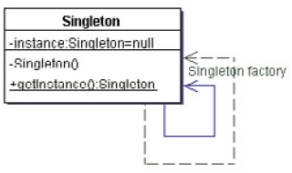

-   ensures that a class has only one instance and provides a global point of access to that class.
-   **Benefits**
    -   Controlled access to sole instance
    -   Reduced name space
    -   Permits refinement of operations and representation
    -   Permits a variable number of instances
    -   More flexible than class operations
-   **When to Use**
    -   There must be exactly one instance of a class

Structural Patterns
-------------------

### Adapter Pattern

-   acts as an intermediary between two classes, converting the interface of one class so that it can be used with the other
-   implements an interface known to its clients and provides access to an instance of a class not known to its clients
-   **Benefits**
    -   Allows two or more incompatible objects to communicate and interact
    -   Improves reusability of older functionality
-   **When to Use**
    -   You want to use an existing class, and its interface does not match the interface you need
    -   You want to create a reusable class that cooperates with unrelated or unforeseen classes
    -   Interface translation among multiple sources must occur

### Bridge Pattern

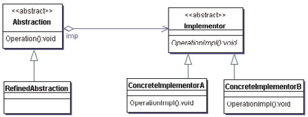

-   divides a complex component into two separate but related inheritance hierarchies
    -   the functional abstraction
    -   and the internal implementation
-   useful when there is a hierarchy of abstractions and a corresponding hierarchy of implementations
    -   Rather than combining the abstractions and implementations into many distinct classes, the Bridge pattern implements the abstractions and implementations as independent classes that can be combined dynamically
-   **Benefits**
    -   Enables you to separate the interface from the implementation
    -   Improves extensibility
-   **When to Use**
    -   You want to avoid a permanent binding between an abstraction and its implementation
    -   Both the abstractions and their implementations should be extensible using subclasses
    -   Changes in the implementation of an abstraction should have no impact on clients

### Composite Pattern

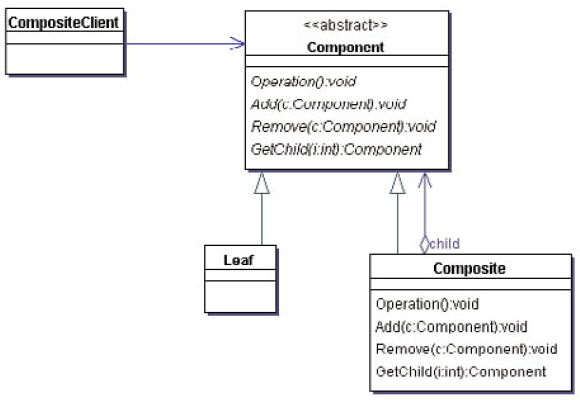

-   enables you to create hierarchical tree structures of varying complexity, while allowing every element in the structure to operate with a uniform interface
-   allows clients to treat individual objects and compositions of objects uniformly
-   **Benefits**
    -   Defines class hierarchies consisting of primitive objects and composite objects
    -   Provides flexibility of structure and a manageable interface
-   **When to Use**
    -   You want to represent the whole hierarchy or a part of the hierarchy of objects
    -   You want clients to be able to ignore the difference between compositions of objects and individual objects
    -   The structure can have any level of complexity and is dynamic

### Decorator Pattern

-   enables you to add or remove object functionality without changing the external appearance or function of the object
-   attaches additional responsibilities to an object dynamically to provide a flexible alternative to changing object functionality without using static inheritance
-   **Benefits**
    -   More flexibility than static inheritance
    -   Simplifies coding
    -   Enhances the object's extensibility because you make changes by coding new classes
-   **When to Use**
    -   You want to add responsibilities to individual objects dynamically and transparently
    -   You want to add responsibilities to the object that you might want to change in the future
    -   Extension by static subclassing is impractical

### Façade Pattern

-   provides a unified interface to a group of interfaces in a subsystem
-   the subsystem is easier to use because you have only one interface
-   **Benefits**
    -   Provides a simple interface to a complex system without reducing the options provided by the system
    -   Promotes weak coupling between the subsystem and its clients
-   **When to Use**
    -   You want to provide a simple interface to a complex subsystem
    -   There are many dependencies between clients and the implementation classes of an abstraction
    -   You want to layer your subsystems

### Flyweight Pattern

-   reduces the number of low-level, detailed objects within a system by sharing objects
-   **Benefits**
    -   Reduction in the number of objects to handle
    -   Reduction in memory and on storage devices, if the objects are persisted
-   **When to Use**
    -   The application uses a large number of objects
    -   The application doesn't depend on object identity

### Proxy Pattern

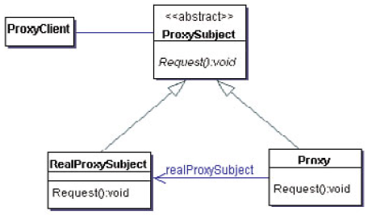

-   provides a surrogate or placeholder object to control access to the original object
-   **Benefits**
    -   A remote proxy can hide the fact that an object resides in a different address space
    -   A virtual proxy can perform optimizations, such as creating an object on demand
-   **When to Use**
    -   You need a more versatile or sophisticated reference to an object than a simple pointer

Behavioral Patterns
-------------------

### Chain of Responsibility Pattern

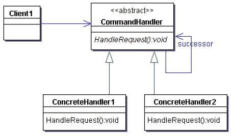

-   establishes a chain within a system, so that a message can either be handled at the level where it is first received, or be directed to an object that can handle it
-   **Benefits**
    -   Reduced coupling
    -   Added flexibility in assigning responsibilities to objects
    -   Allows a set of classes to behave as a whole, because events produced in one class can be sent on to other handler classes within the composite
-   **When to Use**
    -   More than one object can handle a request, and the handler isn't known
    -   You want to issue a request to one of several objects without specifying the receiver explicitly
    -   The set of objects that can handle a request should be specified dynamically

### Command Pattern

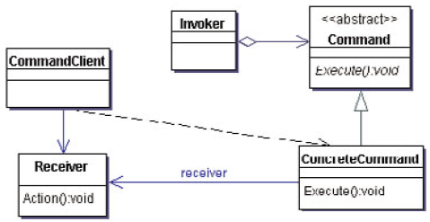

-   encapsulates a request in an object, which enables you to store the command, pass the command to a method, and return the command like any other object
-   **Benefits**
    -   It separates the object that invokes the operation from the one that knows how to perform it.
    -   It's easy to add new commands, because you don't have to change existing classes
-   **When to Use**
    -   You want to parameterize objects by an action to perform
    -   You must support undo, logging, or transactions

### Interpreter Pattern

-   interprets a language to define a representation for its grammar along with an interpreter that uses the representation to interpret sentences in the language
-   **Benefits**
    -   It's easy to change and extend the grammar
-   **When to Use**
    -   The grammar of the language is simple
    -   Efficiency is not a critical concern

### Iterator Pattern

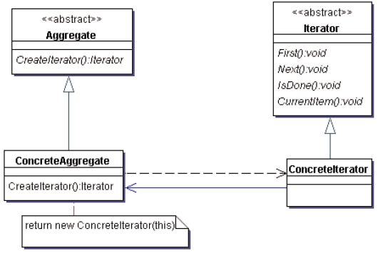

-   provides a consistent way to sequentially access items in a collection that is independent of and separate from the underlying collection
-   **Benefits**
    -   Supports variations in the traversal of a collection
    -   Simplifies the interface of the collection
-   **When to Use**
    -   Access collection object's contents without exposing its internal representation
    -   Provide a uniform interface for traversing different structures in a collection

### Mediator Pattern

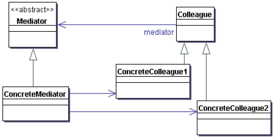

-   simplifies communication among objects in a system by introducing a single object that manages message distribution among other objects
-   promotes loose coupling by keeping objects from referring to each other explicitly, and it lets you vary their interaction independently
-   **Benefits**
    -   Decouples colleagues
    -   Centralizes control
    -   The individual components become simpler and easier to deal with, because they no longer need to directly pass messages to each other
    -   Components are more generic, because they no longer need to contain logic to deal with their communication with other components
-   **When to Use**
    -   A set of objects communicate in well-defined but complex ways
    -   You want to customize a behavior that's distributed between several objects without using subclasses

### Memento Pattern

-   preserves a "snapshot" of an object's state, so that the object can return to its original state without having to reveal its content to the rest of the world
-   **Benefits**
    -   Preserves encapsulation boundaries
-   **When to Use**
    -   A snapshot of an object's state must be saved so that it can be restored to that state later
    -   Using a direct interface to obtain the state would expose implementation details and break the object's encapsulation

### Observer Pattern

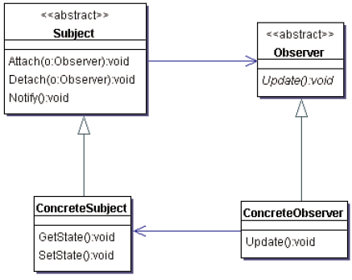

-   provides a way for a component to flexibly broadcast messages to interested receivers
-   **Benefits**
    -   Abstract coupling between subject and observer
-   **When to Use**
    -   A change to one object requires changing the other object, and you don't know how many objects need to change
    -   An object should be able to notify other objects without making assumptions about the identity of those objects

### State Pattern

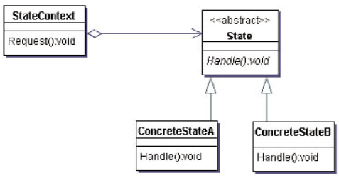

-   allows an object to alter its behavior when its internal state changes
-   **Benefits**
    -   Localizes state-specific behavior and partitions behavior for different states
    -   Makes state transitions explicit
-   **When to Use**
    -   An object's behavior depends on its state, and it must change its behavior at run-time depending on that state
    -   Operations have large, multipart conditional statements that depend on the object's state

### Strategy Pattern

-   defines a group of classes that represent a set of possible behaviors
-   These behaviors can then be used in an application to change its functionality
-   **Benefits**
    -   Defines each behavior in its own class, which eliminates conditional statements
    -   Easier to extend a model to incorporate new behaviors without recoding the application
-   **When to Use**
    -   Many related classes differ only in their behavior
    -   You need different variants of an algorithm

### Template Method Pattern

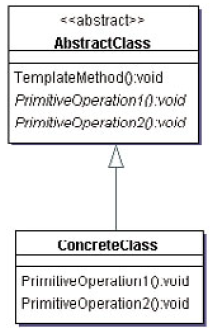

-   provides a method that allows subclasses to override parts of the method without rewriting it
-   Define the skeleton of an algorithm in an operation, deferring some steps to subclasses
-   **Benefits**
    -   Fundamental technique for reusing code
-   **When to Use**
    -   You want to implement the invariant parts of an algorithm once and use subclasses to implement the behavior that can vary
    -   avoid code duplication

### Visitor Pattern

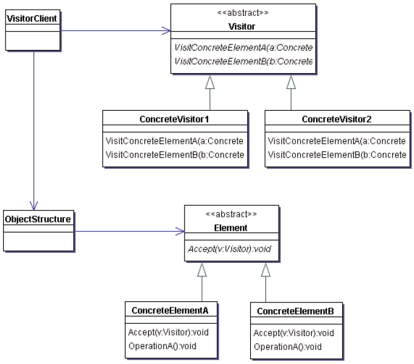

-   provides a maintainable, easy way to represent an operation to be performed on the elements of an object structure
-   lets you define a new operation without changing the classes of the elements on which it operates
-   **Benefits**
    -   Makes adding new operations easy
    -   Gathers related operations and separates unrelated ones
-   **When to Use**
    -   An object structure contains many classes of objects with differing interfaces, and you want to perform operations on these objects that depend on their concrete classes
    -   Classes defining the object structure rarely change, but you often want to define new operations over the structure
